# CI-CD Machine Learning Project

## Project Overview

The focus of this project is to create a **Continous Integration/Continous delivery Machine Learning Pipeline**, using the **industry-standard modular code**. This project can be used as a template for future products, and includes a **detailed implementation and code maintenance guide**. Also, **check the last section of this readme to see how minor adaptations can add new functionalities to this code** (Including a Continous Training - Continous Integration - Continous Delivery pipeline  giving it a higher level of automation).

Although model performance was the primary focus of this project, it acheived a great level. The problem was solved using the students_performance_dataset (regression task). For further information about the data and problem, please refer to `mvp-notebook` module.


**After finishing the project configuration you can interact with the aplication by using the following commands(locally)**

Open the parameters configuration GUI
```bash
python -m configurations.config
```

Run the flask application for predictions
```bash
python app.py
```
flask routes: /predict, /batch_predict

Run the training pipeline:
```bash
python -m src.pipelines.training_pipeline
```

## Project Features

This project contains a lot of useful features that embraces concetps of MLOPS, from model development, experiment tracking, prediction logging, etc...

Bellow you find the explanation to them:

### Minimum Viable Solution Development:

* Perform the Exploratory Data Analysys, checking for data quality and providing insights about our dataset distribution;
* Explore the Data Cleaning/Preprocessing/Transformation process and create the pipeline
* Train some Models in order to discover if we can solve the problem

In this module(`mvp-notebook`) you can see the step by step process, in a ipynb notebook, with comments and conclusions. 

### Data Versioning with DVC

DVC organizes images, audio, files, video and text in **storage** and organize your ml modeling into a **reproductible**.

✨ Basic Uses of DVC:

If you store and process data files or datasets to produce other data or machine learning models 🤖, and you want to:

* Track and save data and ML models just like you do with code;
* Create and switch between **versions of data** and ML models easily;
* Adopt engineering tools and best practices in data science projects.

### E-mail Communication

The E-mail communication is very important, because, by using it, we can inform the Dev/MLEnginner if some problem happened in the pipeline, so he can check it. Also by using our model can have a higher level of autonomy, because the Dev/MLEnginner knows that if something happen, he will know, and will be able to fix it.

This is an a example of how the e-mail feature works:

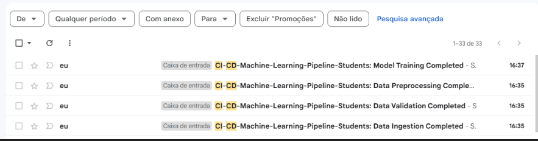

In the `src\utils\__init__.py` the Dev/Machine Learning Engineer can change the default e-mail configuration

### MLFlow Experiment Tracking

MLFlow is an Experiment Tracking tool. Here are the results of the MLFlow implementation:

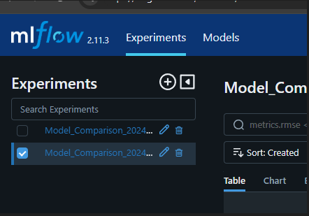

And the experiment will have the models run , we can compare the model s performance

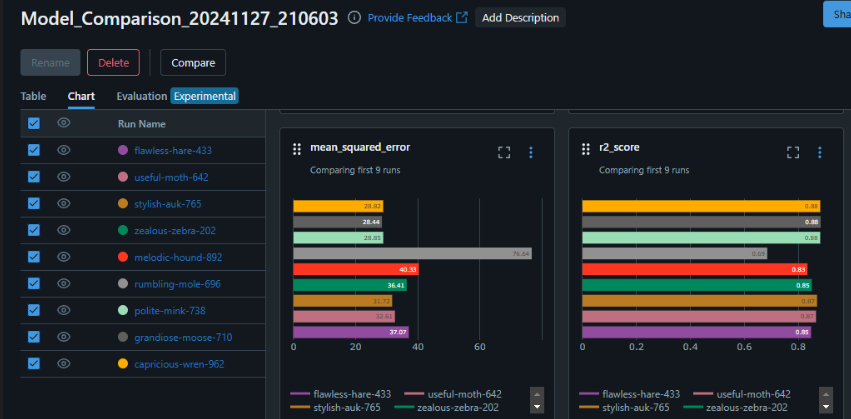

Analyze their hyperparameters: 

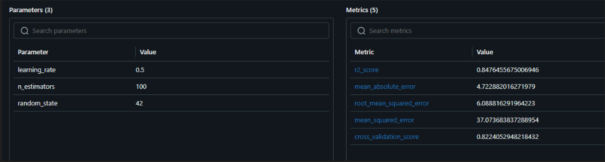

The artifacts, also get logged.

By default this functionality is deactivated, you can activate it by following the comments of the lines 476-478 of the file `src\components\model_training.py`

### Logger

Logging is fundamental to keep track of the pipelines runs, as well, to provide error details in a structured way this is an example of the logging file provided by this application:

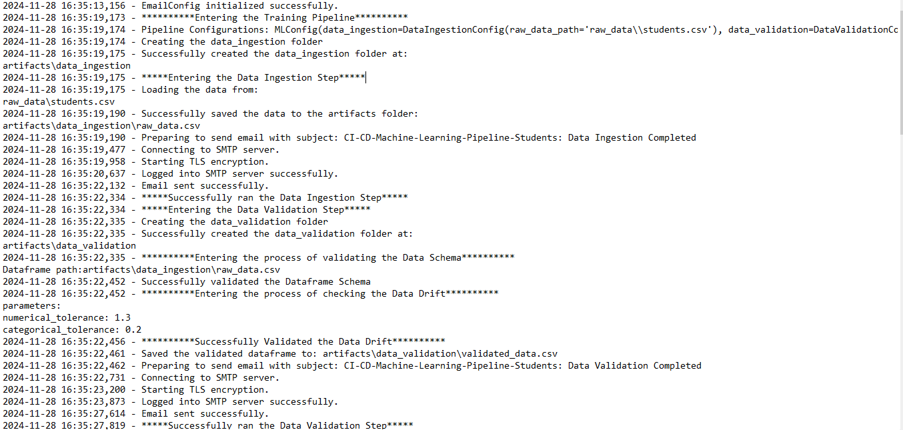

In the `src\utils\logging\__init__.py` the user can change the method, so the type of logging structure is also customized.

### Predictions Logger

The project contains two types of predictions loggings, they are both implemente in `src\components\prediction_logging.py`, and instantiated in `src\pipelines\predict_pipeline.py`

**If you want to change the type of logger just change the object passed to the var logger in `src\pipelines\predict_pipeline.py`**

1. Database Prediction

Logs the inputs and predictions to a Cloud Database as shown:

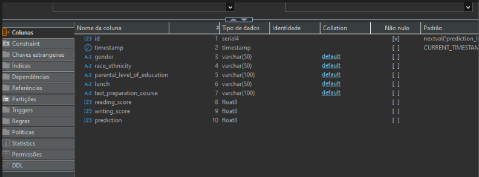

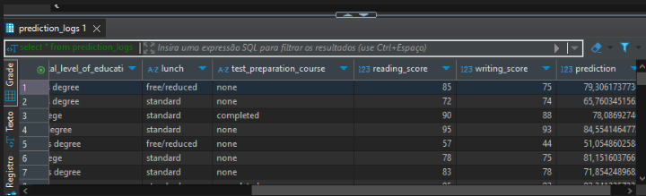

2. Local Predictions

Logs the inputs and predictions to the local file folder, as shown:

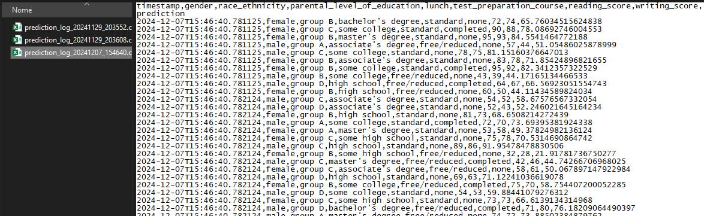

### Configuration Module

This module aims to allow the user to interact/configure the pipeline (this works as a blueprint for the configurations that the user can be allowed to input).

By running:
```bash
python -m configurations.config 
```

The following GUI will open:

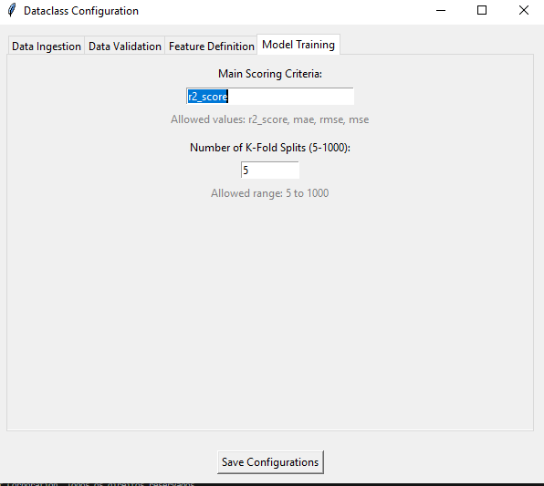

Allowing the user to set some configurations, by clicking in save it will create .json file that will be read(in the `__init__.py`) and transformed into attributes of a MLConfig class.

This is the workflow of the configuration module:

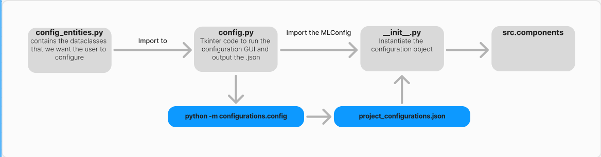

### Training Pipeline

The training pipeline performs the following steps:

1. Ingest the data
2. Validate the data (schema/structure and data drift)
3. Instantiate and train the preprocessor
4. Transform the data and train the model 

Also it Informs the user if the steps ran successfully or if some error happened

### Prediction Pipeline

The predict pipeline imports the object from the prediction component, instantiate the logger, and allow us to perform two types of prediction:

1. Single data-point predicition

2. Batch Prediction

### GitHub Workflow

This feature, allow us to run some action everytime some sort of git command is triggered(push/pull), in our case, it allow us to continous deploy our docker image into an ECR and then serve it using a EC2 container.

Result: 

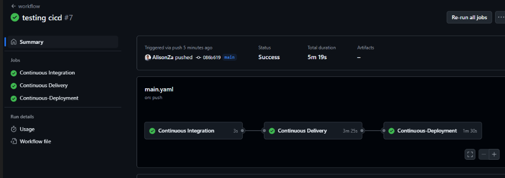


### AWS - Deployment

Allow us to serve our application by using the cloud:


### Technologies Used

* AWS ECR and AWS EC2 - Container Repository and API Cloud Serving
* AWS RDS - Cloud Database for Storing the Predictions Logs
* Flask - API Development
* SKlearn, Numpy and Pandas - Machine Learning
* Pandera - Data Validation
* DVC - Data Versioning
* Docker - Containerization
* Tkinter - Configuration GUI Creation
* GitHub Workflows - Continous Integration/Continous Deployment

## Running the Project on your Computer

1. Create an python 3.10.15 virtual environment, activate this environment
2. Clone this repository by using:
```bash
git clone https://github.com/AlisonZa/ci-cd-machine-learning
```
3. Install the requirements in your virtual environment 

```bash
pip install -r requirements.txt
```

Follow the configurations bellow, and keep updating your .env:

### E-mail

To use e-mails with python you need to create a password App:

**Use App Passwords (Recommended for 2FA accounts)**:

1. Go to your Google Account settings.
2. Navigate to Security, then click on App Passwords.
3. Select Mail and Other (Custom name), then generate the password.
4. This will give you a 16-character password that you can use in your Python script instead of your Google account password.
5. Store this information in your .env

### DVC - Data versioning Setup

```bash
# Initialize DVC in Your Project
dvc init

# Stop Git from Tracking your data 
git rm -r --cached raw_data/students.csv
git commit -m "Stop tracking raw_data/students.csv with Git"

# Start tracking your data file with dvc 
dvc add raw_data/students.csv

# Commit Changes to Git
git add raw_data/students.csv.dvc .gitignore
git commit -m "Track raw_data/students.csv with DVC"
```
Now the DVC is taking care of our data versioning control.
The versions are being cached, and can be restored as checkpoints by the md5 identifier

### DVC Common Commands

#### Changing the Data Version (Local):

1. Update the file

2. Update the DVC Tracking

```Bash
dvc add raw_data/students.csv
```

3. Commit Changes to Git

```Bash
git add raw_data/students.csv.dvc
git commit -m "Updated raw_data/students.csv to the new version <insert details of data version here, or control it by a external log>"
```

#### Restoring an Older Data Version(Local)

1. Identify the Desired Git Commit

```Bash
git log
```

Look for the commit message related to the version you want to restore.

2. Checkout the Desired Commit

```bash
git checkout <commit_hash>
```

3. Checkout the Desired Commit

```bash
dvc checkout
```

**This is will probably change your git status to detached HEAD, be sure to return it and to merge all the necessaries changes**

### DagsHub/MLFlow

We are going to use DagsHub, so we can store our MLFlow Experiments in the Cloud,

Create an account in dagshub, go to the home -> Create + -> New Repository -> Connect a repository -> GitHub -> Choose your repository -> Connect Repository

Getting your Credentials -> Remote -> Experiments -> Get your MLFlow Tracking Remote

Click on Your profile photo -> Your settings -> Get Your Username

Your settings -> Tokens -> Copy your Access token

Update, your .env with those informations

```python
MLFLOW_TRACKING_URI = "https://dagshub.com/yourusername/your-repository-name.mlflow"
MLFLOW_TRACKING_USERNAME ="YouUserName"
MLFLOW_TRACKING_PASSWORD ="40 digits access token"
```

### AWS Cloud Database  

1. RDS -> Create Database -> Mechanism -> PostgreSQL

2. Database settings -> 

* DB instance identifier: prediction-logs-db
* Master username: postgres
* Create a password
* Public Access Avaiable
* Security -> Create new security group -> Name it: prediction-logs-sg
* Additional configurations -> Initial database name: prediction_logs_db -> Create Database

3. Connection Details:

* DB_ENDPOINT = "db-identifier.sdadkas.aws_region.rds.amazonaws.com"
* DB_USER = "postgres"
* DB_PASSWORD = "your-password"
* DB_PORT = "5432" 
* DB_NAME = "your_db_name" (distinct from db-dentifier)

4. Security Groups:

security group -> Edit inbound rules:

* Type: PostgreSQL
* Port Range: 5432
* Source: 0.0.0.0/0 **(for testing, more restrictive in production)**

### CI-CD Pipeline Ensembling and AWS EC2/ECR Configuration

#### Dockerizing:

1. We are going to freeze our pip dependencies using:

```bash
pip freeze > requirements.txt
```

2. We are goint to create the `dockerfile`, using the python version that our project has been built with

This `dockerfile` is going to be build in some cloud provider, everytime we made a new commit, to do so, we need to set a `github workflow` 

3. Create a `.dockerignore` and write `.env` in there (good security practice)

The dockerfile will be mounted within the CICD run

#### Setting Up GitHub Workflow:

1. Create the folder `.github\workflows`

2. Inside this folder create the `main.yaml`

#### AWS Deployment

Description: About the deployment (all of these steps are going to be automatically performed by our CI-CD pipeline)

1. Build docker image of the source code

2. Push your docker image to ECR

3. Launch Your EC2

4. Pull Your image from ECR in EC2

5. Lauch your docker image in EC2

##### IAM

IAM -> Users -> Create new user -> Attach policies directly:

Attach the following policies:

* AmazonEC2ContainerRegistryFullAccess 
* AmazonEC2FullAccess

Open your created_user -> Security credentials -> Create access key -> Use Case(Command Line Interface (CLI)) -> Create the Acess key -> save both to your .env

```python
AWS_ACCESS_KEY = ""
AWS_SECRET_ACCESS_KEY = ""
```

##### ECR

Amazon Elastic Container Registry -> Create a repository -> Create -> Name it and create -> Save your uri

```python
ECR_LOGIN_URI = "alotofnumbers.dkr.ecr.your-region.amazonaws.com"
ECR_REPOSITORY_NAME  = "your-ecr-name"
```

##### EC2

1. Create EC2 machine (Ubuntu)

EC2 -> Instances -> Launch instances -> Application and OS Images -> Choose Ubuntu -> Network settings -> Allow Https and Http -> Launch Instance

Choose your instance -> Security -> Choose the security group -> Edit Inbound Rules -> Add a new inbound rule(custom TCP-8080-Anywhere-0.0.0.0/0) -> Save rules

2. Open EC2 and Install docker in EC2 Machine:

Select your instance -> Connect -> Run the following code:

```bash
#optional
sudo apt-get update -y
sudo apt-get upgrade

#required
curl -fsSL https://get.docker.com -o get-docker.sh
sudo sh get-docker.sh
sudo usermod -aG docker ubuntu
newgrp docker
```

##### Self-hosted Runner and Github Secrets Configuration:

1. Configure EC2 as self-hosted runner

Github -> Project Repository -> Settings -> Actions -> Runners -> New self hosted runner -> RunnerImage is Linux ->  Run each command line in your EC2 terminal (when it asks for name of runner input : self-hosted)

2. Setting up github secrets

Github -> Project Repository -> Settings -> Actions -> Security -> Secrets and Variables -> Actions -> Add your environment variables

```python
AWS_ACCESS_KEY
AWS_REGION
AWS_SECRET_ACCESS_KEY
DB_ENDPOINT
DB_NAME
DB_PASSWORD
DB_PORT
DB_USER
ECR_LOGIN_URI
ECR_REPOSITORY_NAME
```

## Code Maintenance Guide

### New Data

1. In `schemas\data_structure.py` adapt the data_validation rules

2. Run the following code to create the statistics references to your dataframe

```python
# TODO: Update this according to your dataset
NUMERIC_Y_TARGET = "math_score"
NUMERIC_SCALARS = ["reading_score", "writing_score"]
CATEGORICAL_NOMINALS = ["gender", "race_ethnicity", "lunch", "test_preparation_course"]
CATEGORICAL_ORDINALS = ["parental_level_of_education"]

import pandas as pd
import json

# Example reference data
reference_data = pd.read_csv("raw_data/students.csv")# TODO: Change this to your dataframe

# Compute statistics
reference_stats = {}

# Numerical features
for feature in numeric_features:
    reference_stats[feature] = {
        "mean": reference_data[feature].mean(),
        "std": reference_data[feature].std(),
        "percentiles": reference_data[feature].quantile([0.25, 0.5, 0.75]).to_dict()
    }

# Categorical features
for feature in categorical_features:
    reference_stats[feature] = {
        "value_counts": reference_data[feature].value_counts(normalize=True).to_dict(),
    }

# Save to a JSON file
with open("schemas/reference_stats.json", "w") as f:
    json.dump(reference_stats, f)
```

3. Update the Feature Definition class in `src\entities.py`

4. Update the data_preprocessing steps in `src\components\data_preprocessing.py`

5. Update both dataclasses `PredictionInput` and `PredictionOutput` in `src\entities.py`

6. In `src\components\prediction_logging.py`:

* class `PredictionLoggerLocal`: Update the section # Prepare log data
* class `DatabasePredictionLogger` Update the query of the method `_create_predictions_table`, in the method `log_prediction` update the section commented with `# Prepare database entry` and `# Prepare prediction data for CSV`, still in this method, update the variable `insert_query` 

7. In `src\pipelines\predict_pipeline.py`, function `batch_predict_pipeline`: update the section commented with `# Convert DataFrame rows to PredictionInput instances` 

8. In `src\components\prediction.py`,  class `RegressionComponent`, method `predict`: update the variable: `features_list`

9. Update your html templates in `templates` to support the new input/output variables

### New Components/ Pipeline

This is how the basic component/pipeline are structured:

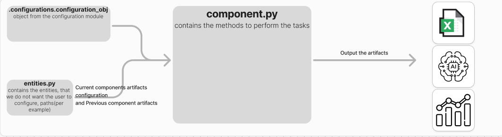

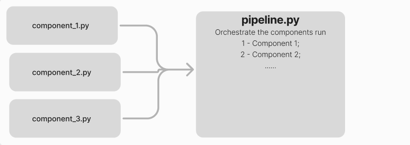

0. You can test by running your code in a Jupyter Notebook in `research`

1. Update the `src\entities.py` with the dataclass that is going to serve as input to your component class

* It can contain paths to your model output 
* Configurations/params
* Attributes that are going to be shared across different methods of the step

2. (Optional) If you want to create some parameter that you want the user to interact with you can update the `configurations` module:

* Update the `configurations\config_entities.py`
* Update the `configurations\config.py` (create the tabs and the validation rules)
* Update the `configurations\__init__.py` (`class MLConfig` and `method from_json`)

3. Create your `component.py` file

* Create a class with a contructor method (usually receive the previous step artifacts, this new step artifacts configuration, and any additional parameters[users input])

4. Update your pipeline `src\pipelines\your_pipeline.py` with the components.

## Modifications to Add New Functionalities

1. The aim of this project, was to make a highly automated, data-centric project however with little adjustements this project could support human interation, such as:

* Train different Models, report their performance, and asks to the user which one of them he want to tune, as well with the Grid Search Parameters;

* Perform the process above, and ask what models the user wants to ensemble;

* These process could run automatically, and them notify via e-mail(or a dashboard) when the user needs to interact;

* If this is our objective, we can implement and iterative human-in-the-loop Error-Analysys/Feature Engineering.

* The user interaction could be done by a module simmilar to the configurations module

By doing that, we will have a process with less automation, but with greater human control

2. By now this code is triggered by pull/push, however it also can be triggered by different options, and be classified as **`Continous Training(CT)`**(for now the re-training is triggered by the user) with a few adjustements:

* Locally (cost saving) we could use the windows `task_scheduler` to run a `.py` file that checks for changes in our dataset(number of samples as an example) time by time(every 4 hours as an example), and then triggers our pipeline once some condition gets satisfied.

* Cloud, we could use some service, such as `AWS lambda`, uncomment the endpoint of `/train` (commented for deployment), and them trigger this endpoint when some condition gets satisffied.

3. Because we keep track of the inputs and the predictions we can easily implemente a fully automated/ highly automated monitoring module as shown:

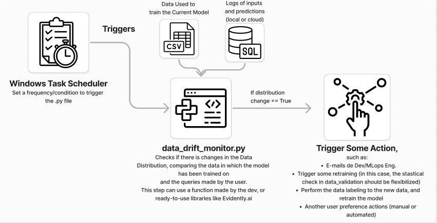

## Future Improvements

* Add Evidently AI to the data validation and Monitoring steps

* Implement checkpoint for pipeline steps

* Update the data ingestion pipeline so it can handle multiple file extensions


